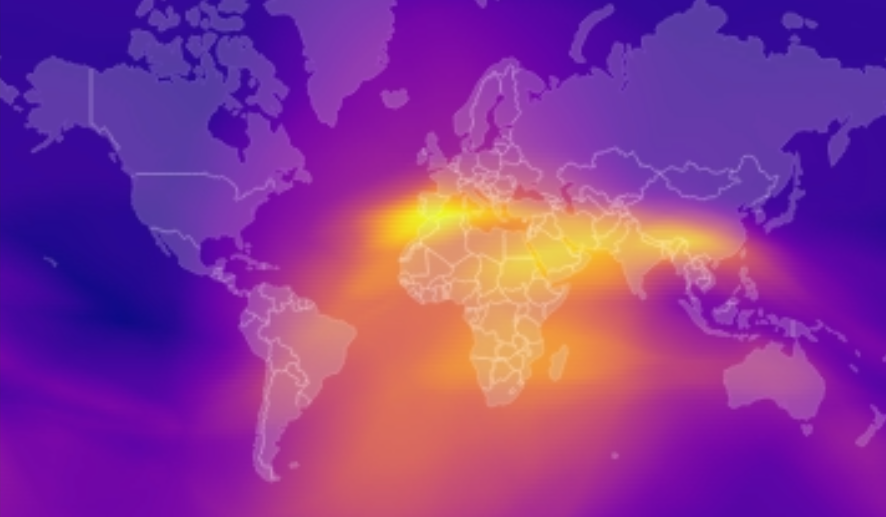

# Data Science Lab: Deep Learning for Ionosphere Modeling

Welcome to the code repository for the ETHZ Data Science Lab 2025, challenge 16! This codebase comprises code to train and evaluate neural networks for Ionospheric Modeling.

## Contents

- [About](#about)
- [Installation](#installation)
- [Datasets](#datasets)
- [Training](#training)
- [Inferences](#inferences)
- [Evaluation](#evaluation)
- [Video](#video)
- [Miscellaneous](#miscellaneous)
- [License](#license)


## About
The codebase allows to:
- Train neural networks from scratch in order to build global STEC maps for a short period of time (typically 1 day).
- Pretrain neural networks on subsampled data corresponding to a longer period of time (January 2022 to June 2024 in our setup)
- Subsample STEC daily datasets in order to generate the pretraining data.
- Fine tune pretrained neural networks in order to build global STEC maps for a short period of time.
- Use a trained model to run inferences on datasets comprising a short period of time.
- Run data analysis and visualizations on inferences results.
- Make videos that show the predicted STEC of our models overlaid to an Earth map as a function of time.

The code is designed to run in the ETHZ Euler cluster. The Python environment has been tested on Euler. Pretrainings on Euler take 2-6 hours depending on the amount of data. While the testing coverage for the code outside has been less extense, the following instructions can also be followed outside Euler and everything should work. Training and inference times will depend on the user's available resources.

The datasets used for this project are private. However, we provide a small mock dataset with random numbers with the same schema as the real dataset which can be used to run end to end the training code. This example can be found under the section [Training](#training).

## Installation
- Clone the repository with `git clone git@github.com:eboesch/IonosphereModel.git`
- If working on the Euler cluster, run `module load stack/2024-06 python/3.11.6`. If running in your local machine, this step can be skipped.
- Create a virtual environment with `python3 -m venv ./venv` and activate it with `source venv/bin/activate`.
- Install the required Python packages with `pip install -r requirements.txt`.

## Datasets

### Dataset description
The dataset is private and can be found in the cluster location `/cluster/work/igp_psr/arrueegg/GNSS_STEC_DB/`. For each year and day of the year, an h5 file contains the STEC measurements for that day. All the code related to dataset manipulation can be found under the folder `datasets` in this repository.

### Dataset splits
We divided the dataset into training, validation and test stations. Training stations are used to optimize the training loss. Validation stations are used for model selection. Test stations are used to estimate our models generalization error. 

The lists of stations within each split are contained in the files `train.list`, `val.list` and `test.list`. We use the same splits as in the [project supervisor repository](https://github.com/arrueegg/STEC_pretrained/tree/main). The script `dataset/split.py` can also be used to generate new random splits.

### Data Reorganization
The dataset format is suitable for training models from scratch or for fine-tuning pretrained models in a short period of time (few days). However, the structure of the dataset is not suitable for pretraining models, given that the dataset is very large and cannot fit on memory, and also train, val and test data are mixed within the files for each day.

We reorganized the data separating it into train, val and test files and subsampling it. The subsampled dataset fits in memory, which is a key factor to speed up the training, and it can be manipulated more easily since the training, validation and test data are separated.

The script to run data reorganization can be run with
```bash
 srun --ntasks=1 --cpus-per-task=6 --mem-per-cpu=4096 -t 600 -o file.out -e file.err python dataset/reorganize_data.py &
```
Outside the Euler cluster, provided that the user has a copy of the dataset in its machine, it could also be run with
```bash
python dataset/reorganize_data.py
```
The parameters for the data reorganization (time period for which to subsample and reorganize the data, subsampling ratio, etc.) are contained in the config file `config/reorganize_data_config.yaml`.

### Solar Indices? Elena decides where it is better to talk about them

## Training

Models can be trained on the Euler cluster with
```bash
srun --ntasks=1 --cpus-per-task=8 --mem-per-cpu=8192 -G 1 -t 600 -o file.out -e file.err python run_training.py &
```
If training on a local machine, simply run
```bash
python run_training.py
```
Every time a model is trained, a folder is created to store the model weights, training log, and config file used to launch the training. The folder name is associated to the timestamp of the training start and is used as a model id. 

### Training config

The training script is parametrized by a config file, which is specified in the `config_path` variable at the beginning of the file. We now describe some relevant variables in the training config files:
- `num_workers` is the number of cpus that will be used in the DataLoader. We recommend 8-32. In the `srun` arguments, set `--cpus-per-task` to the same number as `num_workers`. If the number of cpus is large, the `--mem-per-cpu` argument can be set to a lower number to keep the total shared memory constant.
- `use_reorganized_data`: Whether to use the original dataset for training (`false`) or the reorganized dataset (`true`). Set to `true` for pretraining and to `false` for fine-tuning.
- `pretrained_model_path`: Path to a pretrained model. If specified, the weights of such model will be loaded for training and the architecture related config parameters will be ignored. If set to `null`, a new model is initialized with random weights using the architecture related config parameters. For pretraining or training a model from scratch, we set `pretrained_model_path` to `null`. For fine-tuning, `pretrained_model_path` needs to point to the desired pretrained model folder.
- `optional_features`: ELENA

Check the config files under `config/` for a full description of each variable parametrizing the trainings.

### Available configs: Pretraining, fine-tuning and mock trainings

We provide multiple config files for different functionalities:

- `config/training_config.yaml` can be used to fine-tune models or to train models initialized with random weights on data corresponding to a short time period. Whether a pretrained model is used or not is determined by the `pretrained_model_path` in the config file, see the section above.
- `config/training_mock_config.yaml`can be used to train a model from scratch on the mock dataset.
- `config/pretraining_config.yaml` can be used to pretrain models on data corresponding to a large period of time (see the section [Data Reorganization](#data-reorganization)).


### Launching mock trainings
BLA BLA BLA


## Inferences
The script `run_inferences.py` is used to run inferences for a given model. It is parametrized by the `config/inferences_config.yaml` file. In order to run inferences for a given model, specify the `model_path` variable within the inferences config file, and run (in the Euler cluster)
```bash
srun --ntasks=1 --cpus-per-task=8 --mem-per-cpu=8192 -G 1 -t 600 -o file.out -e file.err python run_inferences.py &
```
If running on a local machine, simply run
```bash
python run_inferences.py
```
Inferences can be run for the training, validation or test split for the data corresponding to a short period of time (typically one day). They can also be run on an additional satellite altimetry test dataset (check the variable `evaluation_data` within `config/inferences_config.yaml`).

The inferences script generates an inferences subfolder within the model folder for the model used to run inferences. The Mean Absolute Error and Mean Squared Error are saved in a csv file `metrics.csv`. The model predictions, labels, and features for each entry in the dataset are stored in `inferences.csv`.

## Evaluation
Elena talk about plots with val loss 


`analysis.ipynb` takes in an inference file and calcules the MAE. It then breaks down the MAE by region, local time and elevation angle.


## Video

`video/global_inference.py` calculates model inferences for every part of the world for an entire day. `video/make_video.ipynb` creates visualizations of those inferences and stiches them together to make a video.

## Miscellaneous
Nerf stuff

## License

This project is licensed under the MIT License. See the [LICENSE](LICENSE) file for details.
